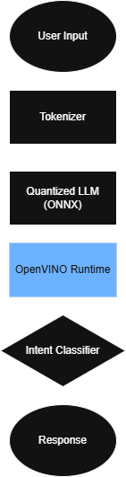

# 🚀 Edge-Optimized Offline LLM Inference

**Running a 1.5B parameter language model offline on resource-constrained edge devices (≤2GB RAM) using ONNX and OpenVINO.**

## 🧠 Problem Statement
Most LLM deployments rely on high-end cloud GPUs and unlimited memory. This project solves the inverse problem: **How do you maintain sub-second responsiveness and high accuracy on consumer-grade edge hardware?** 

By leveraging aggressive quantization and hardware-aware compilation, this system enables secure, air-gapped AI capabilities for kiosks, IoT, and privacy-first applications.

## 🏗️ High-Level Architecture

The pipeline utilizes an **ONNX-optimized** backbone with an **OpenVINO** runtime to execute a quantized 1.5B LLM, followed by a high-speed intent classification head.

## 📊 Performance Benchmarks
Detailed metrics and benchmarking methodology are located in the [Benchmarks folder](./benchmarks/latency_results.md).

| Metric | Result |
| :--- | :--- |
| **Average Latency** | < 900 ms |
| **Peak Memory Usage** | ~1.84 GB |
| **Intent Accuracy** | 95% |
| **Target Hardware** | 2GB RAM / CPU-only Edge Devices |

## 📑 Engineering Documentation
This project prioritizes "System Thinking" over simple scripting. Explore the detailed documentation:
- **[Engineering Tradeoffs](docs/tradeoffs.md)**: Why we chose INT8 over FP16 and the impact of sequence length caps.
- **[Failure Modes](docs/failure_modes.md)**: Analysis of OOM risks, intent drift, and production mitigations.

## ✨ Key Features
- **Zero-Cloud Dependency**: 100% offline inference for secure environments.
- **Memory-Bounded Design**: Specifically tuned to stay within strict 2GB RAM limits.
- **Hardware-Aware Compilation**: Optimized for CPU-only inference using OpenVINO operator fusion.
- **Production-Ready Structure**: Modular design separating inference logic from optimization pipelines.

## 📂 Repository Structure
- `inference/`: Contains `runtime.py` and `intent_classifier.py`.
- `model_optimization/`: Scripts for quantization and `Modelfile` configuration.
- `benchmarks/`: Raw data and performance results.
- `docs/`: Technical deep-dives and architectural decisions.
- `architecture/`: System design diagrams.

## 🛠️ Tech Stack
- **Languages/Frameworks**: Python, ONNX, OpenVINO
- **Optimization**: INT8 Quantization, Graph-level Operator Fusion

## 🚀 Getting Started
1. **Clone the repo:**
   `git clone https://github.com/your-username/edge-llm-inference.git`
2. **Install dependencies:**
   `pip install -r requirements.txt`
3. **Run Inference:**
   `python inference/runtime.py`

## 🛣️ Roadmap
- [ ] Implement INT4 weight-only quantization for extreme memory constraints.
- [ ] Add support for ARM-based edge devices (Raspberry Pi/Jetson).
- [ ] Integrate "Small Model" fallback logic for low-confidence intent detection.